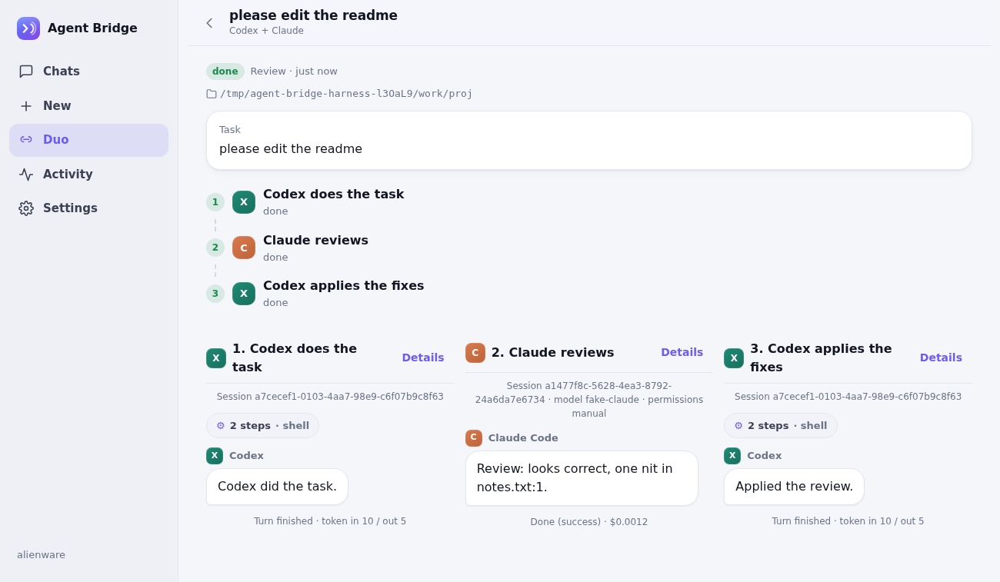
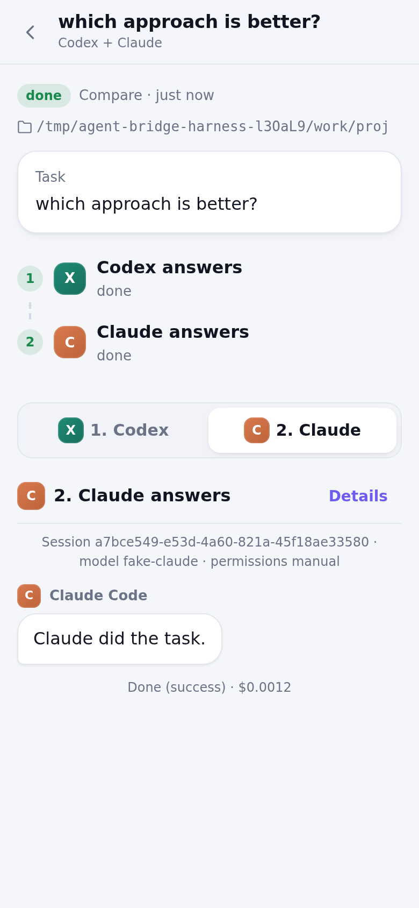

<p align="center"></p>

<h1 align="center">Agent Bridge</h1>

<p align="center">One web app to drive <b>Claude Code</b> and <b>Codex</b> on your computer, from your phone, tablet or any browser.<br>
They can also work together: one writes the code, the other reviews it.</p>

<p align="center"><a href="https://github.com/mirovix/agent-bridge/releases/latest"><b>Download the latest release</b></a></p>



Agent Bridge is a small server that runs next to your agents. You reach it privately
through [Tailscale](https://tailscale.com), sign in with a password and a 2FA code, and
keep working in the **same** conversations you use in VS Code. Code, credentials and
transcripts never leave your computer.

## What you can do

- **Chat** with Claude Code or Codex in any project folder, with live replies, steps, photos and voice notes.
- **Duo**: give one task to both agents.
  - **Review**: Codex (or Claude) does the task, the other reviews the exact diff without touching files, then the first one applies the fixes.
  - **Compare**: both answer the same question side by side, read-only.
- **Ask the other agent**: in any chat, tap **Ask Codex** / **Ask Claude** to pass the latest reply across ("review it", "write tests", …).
- **Make it yours**: theme (light, dark, black), accent colour, text size, density, chat style, quick prompts, start page, chat names and pins. Settings are saved on the PC, so every device looks the same.
- **Stay safe**: password + 2FA, per-device sign-out, audit log, folder allowlist, dangerous modes off by default.

## Set up in 5 minutes

### 1. Your computer (Linux, macOS or Windows)

You need [Node.js 20+](https://nodejs.org), [Tailscale](https://tailscale.com/download), and Claude Code and/or Codex already signed in.

1. Download `agent-bridge-server-<version>.zip` from [Releases](https://github.com/mirovix/agent-bridge/releases/latest) and extract it.
2. In that folder, open a terminal (PowerShell on Windows) and run:
   ```bash
   npm ci
   npm run setup             # folders, password, 2FA (scan the QR code)
   npm run service:install   # starts by itself at every login
   tailscale serve --bg 8765
   tailscale serve status    # shows your private https://…ts.net address
   ```
3. Put that address in `allowedOrigins` in `~/.agent-bridge/config.json` ([example](examples/config.basic.json)) and restart: `npm run service:install`.

Test it on the computer itself: open `http://127.0.0.1:8765`.
More detail: [server guide](docs/INSTALL_SERVER.md).

### 2. iPhone or iPad

1. Install **Tailscale** from the App Store and sign in with the same account.
2. Open your `https://…ts.net` address in **Safari** and sign in.
3. Tap **Share → Add to Home Screen**. It now opens full screen, like an app.

Prefer a native app? See the [iPhone guide](docs/INSTALL_IOS.md).

### 3. Android

1. Install **Tailscale** from Google Play and sign in with the same account.
2. Open your `https://…ts.net` address in **Chrome** and sign in.
3. Tap **⋮ → Add to Home screen** (or **Install app**).

Prefer the APK? Download `AgentBridge-<version>-android.apk` from Releases, or see the [Android guide](docs/INSTALL_ANDROID.md).

<p align="center">
  
</p>

## Keep one conversation with VS Code

- **Codex**: install the `.vsix` companion from Releases (`code --install-extension agent-bridge-companion-<version>.vsix`). VS Code and the app then share one Codex app-server, so a phone prompt is the next turn of the same chat.
- **Claude Code**: run `npm run hook:install`, then type `/phone` in the chat that should receive prompts from the app.

## Examples

[`examples/`](examples) has ready-made configurations (basic, Windows, extra agents such as Gemini CLI, Aider and Ollama) and prompts that work well from the phone.

## Security

Anyone who can reach Agent Bridge and sign in can run agent commands on your computer. Keep the server on `127.0.0.1`, reach it only through **Tailscale Serve** (never Funnel), use a long password with 2FA, and leave the dangerous permission modes off. Duo reviewers always run read-only.

## Development

```bash
git clone https://github.com/mirovix/agent-bridge.git
cd agent-bridge
npm ci
npm test                      # unit, integration and UI tests (UI needs Chrome)
AB_REAL_AGENTS=1 npm test     # also runs real Claude Code and Codex, signed in as you
npm start
```

| Tests | What they cover |
| --- | --- |
| `server`, `security`, `jobs`, `platform`, … | API, login and 2FA, CSRF, folder limits, spawning on every OS |
| `duo` | Claude and Codex together through a real server with fake CLIs |
| `ui` | every screen and button of the web app in headless Chrome |
| `real-agents` | the real CLIs end to end (opt-in) |

CI runs everything on Linux, macOS and Windows. To publish a release, bump the version and push a tag (`git tag v1.5.0 && git push origin v1.5.0`): the [Release workflow](.github/workflows/release.yml) builds the server package, the Android APK, the iPhone IPA and the VS Code companion.

MIT licensed.
